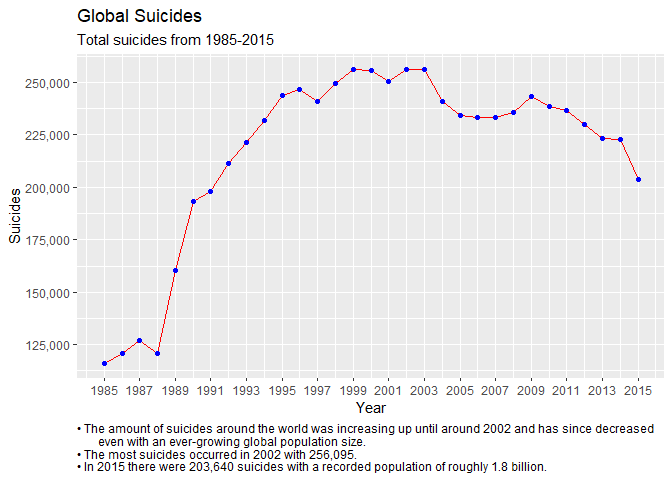
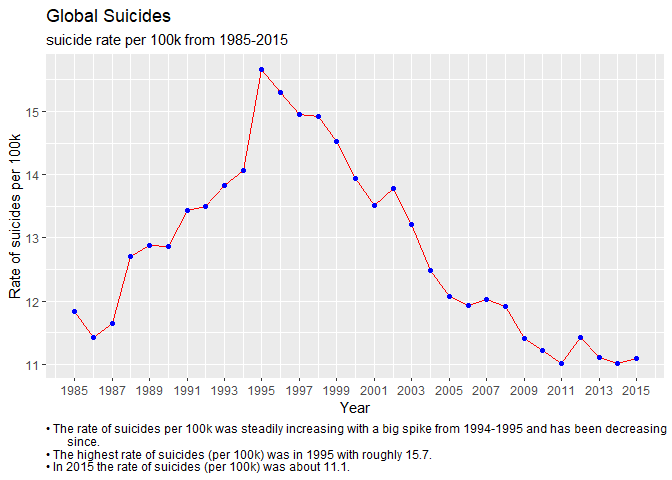
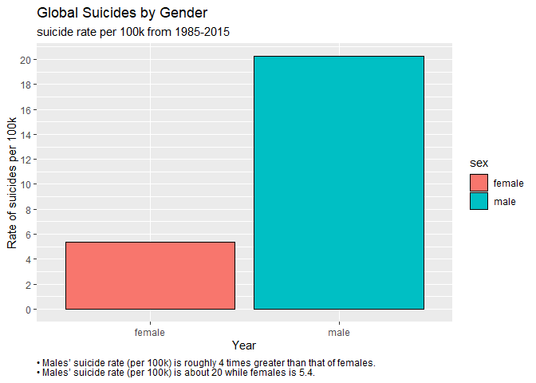
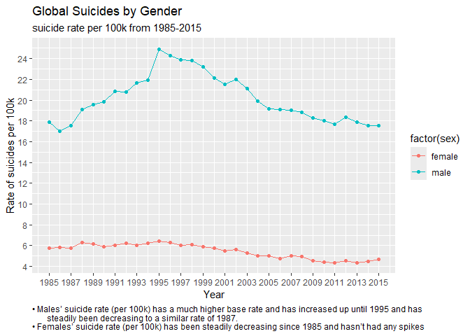
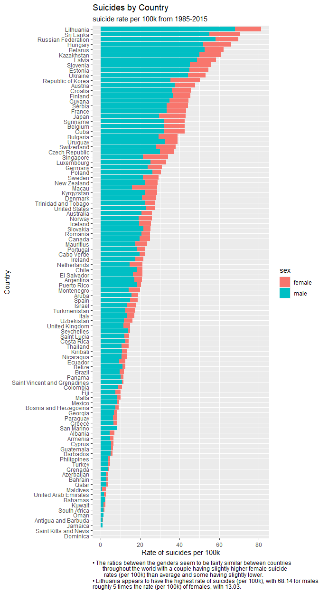
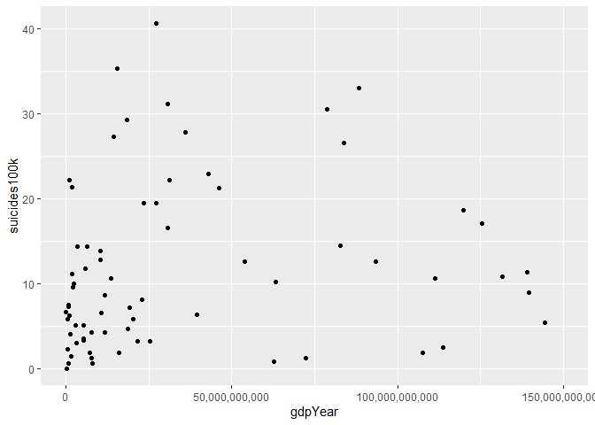

Suicide Rates
================

- [Suicide Rates of Men and Women](#suicide-rates-of-men-and-women)
  - [Libraries](#libraries)
  - [The Data](#the-data)
  - [The Study](#the-study)
  - [Data Cleaning](#data-cleaning)
  - [Analysis](#analysis)
    - [The Change in Suicide Rate Over
      Time](#the-change-in-suicide-rate-over-time)
    - [Differences in Gender with
      Suicide](#differences-in-gender-with-suicide)
    - [Geographical Analysis](#geographical-analysis)
    - [Country Analysis](#country-analysis)
  - [Model](#model)
  - [Conclusions and Final Thoughts](#conclusions-and-final-thoughts)

# Suicide Rates of Men and Women

## Libraries

``` r
suppressMessages(library(tidyverse))
suppressMessages(library(dplyr))
suppressMessages(library(ggplot2))
suppressMessages(library(rworldmap))
suppressMessages(library(corrplot))
suppressMessages(library(modelr))
```

## The Data

The data I will be using are from the World Health Organization:

**THE DATA:** Some data has been removed due to lacking a substantial
amount of inputs or causing problems with how it was originally set
up(HDI, data from 2016, and the generation variable)

**country:** Country the suicide is in

**year:** year it occurred

**sex:** gender of the individual

**age:** age of the individual split up into groups 5-14 15-24 25-34
35-54 55-74 75+

**suicides_no:** number of suicides in that year for that sex and age
group

**population:** population of the country for that year, sex, and age

**suicides.100k.pop:** suicides per 100k population per gender per age
group

**gdp for year:** Gross Domestic Product for the year

**gdp per capita:** Gross Domestic Product per capita

## The Study

The main purpose of analyzing global suicides from 1958 to 2016 is to
answer a few questions that came to mind when seeing this data; How has
the rate of suicide has changed over time, which gender is more likely
to commit suicide and the level of impact each factor has on it, is
there a correlation between GDP and the suicide rates of countries, and
do different countries have different trends in suicides. Another
thought I had when finding this data, was to see if there are trends and
when similar data is released from 2020, during the Covid pandemic it
will be possible to compare the past trends with it and see how the
patterns have changed.

**The main questions I’ll be answering and expounding upon are as
follows:**

**1.** How has the rate of suicide changed over time?

**2.** Which gender is more likely to commit suicide?

**3.** Is there a correlation between GDP and the suicide rates of
countries? - Do different countries have different rates of suicide?

``` r
#loading in data
df<- read.csv("master.csv")
head(df)
```

    ##   country year    sex         age suicides_no population suicides.100k.pop
    ## 1 Albania 1987   male 15-24 years          21     312900              6.71
    ## 2 Albania 1987   male 35-54 years          16     308000              5.19
    ## 3 Albania 1987 female 15-24 years          14     289700              4.83
    ## 4 Albania 1987   male   75+ years           1      21800              4.59
    ## 5 Albania 1987   male 25-34 years           9     274300              3.28
    ## 6 Albania 1987 female   75+ years           1      35600              2.81
    ##   country.year HDI.for.year gdp_for_year.... gdp_per_capita....      generation
    ## 1  Albania1987           NA       2156624900                796    Generation X
    ## 2  Albania1987           NA       2156624900                796          Silent
    ## 3  Albania1987           NA       2156624900                796    Generation X
    ## 4  Albania1987           NA       2156624900                796 G.I. Generation
    ## 5  Albania1987           NA       2156624900                796         Boomers
    ## 6  Albania1987           NA       2156624900                796 G.I. Generation

``` r
colnames(df)
```

    ##  [1] "country"            "year"               "sex"               
    ##  [4] "age"                "suicides_no"        "population"        
    ##  [7] "suicides.100k.pop"  "country.year"       "HDI.for.year"      
    ## [10] "gdp_for_year...."   "gdp_per_capita...." "generation"

## Data Cleaning

``` r
#cleaning up the data -- removing hdi and generation and country.year as a lot of entries had no value for HDI and the generation value causes problems with the continuous data
df <- df[ !(grepl("2016", df$year) ), ]
drops <- c("HDI.for.year", "generation", "country.year")
df <-df[ , !(names(df) %in% drops)]

df <- df %>%
  rename(gdp_for_year = gdp_for_year...., 
         gdp_per_capita = gdp_per_capita....)

#create new column to have age as a numeric value
df <- df %>%
        mutate(ages = as.numeric(factor(age)))
head(df)
```

    ##   country year    sex         age suicides_no population suicides.100k.pop
    ## 1 Albania 1987   male 15-24 years          21     312900              6.71
    ## 2 Albania 1987   male 35-54 years          16     308000              5.19
    ## 3 Albania 1987 female 15-24 years          14     289700              4.83
    ## 4 Albania 1987   male   75+ years           1      21800              4.59
    ## 5 Albania 1987   male 25-34 years           9     274300              3.28
    ## 6 Albania 1987 female   75+ years           1      35600              2.81
    ##   gdp_for_year gdp_per_capita ages
    ## 1   2156624900            796    1
    ## 2   2156624900            796    3
    ## 3   2156624900            796    1
    ## 4   2156624900            796    6
    ## 5   2156624900            796    2
    ## 6   2156624900            796    6

## Analysis

### The Change in Suicide Rate Over Time

If we first look at the amount of suicides that have occurred each year
from 1985-2015 we can get a general idea about the change over time.
Then, go more into specific variables and their changes over time in
regards to suicides per 100k later on to answer the question about how
the rate of suicide has changed over time and some other related
variables along with it.

``` r
#show the trend of global suicides per 100k over time

df %>% 
  group_by(year) %>%
  summarise(Suicides = mean(sum(suicides_no))) %>%
  ggplot(aes(year, Suicides)) + 
  geom_line(col= "red") + 
  geom_point(col = "blue") +
  scale_x_continuous(breaks = seq(1985, 2015, 2)) +
  scale_y_continuous(breaks = seq(50000, 300000, 25000), labels = scales::comma) +
  theme(plot.caption=element_text(hjust = 0)) +
  
  labs(title = "Global Suicides", 
       subtitle = "Total suicides from 1985-2015",
       x = "Year",
       y = "Suicides",
       caption = "• The amount of suicides around the world was increasing up until around 2002 and has since decreased 
       even with an ever-growing global population size.
• The most suicides occurred in 2002 with 256,095.
• In 2015 there were 203,640 suicides with a recorded population of roughly 1.8 billion. ")
```

<!-- -->

``` r
df %>% 
  group_by(year) %>%
  summarise(suicides100k = sum(mean(suicides.100k.pop))) %>%
  ggplot(aes(year, suicides100k)) + 
  geom_line(col= "red") + 
  geom_point(col = "blue") +
  scale_x_continuous(breaks = seq(1985, 2015, 2)) +
  scale_y_continuous(breaks = seq(10, 15, 1)) +
  theme(plot.caption=element_text(hjust = 0)) +
  
  labs(title = "Global Suicides", 
       subtitle = "suicide rate per 100k from 1985-2015",
       x = "Year",
       y = "Rate of suicides per 100k",
       caption = "• The rate of suicides per 100k was steadily increasing with a big spike from 1994-1995 and has been decreasing 
       since. 
• The highest rate of suicides (per 100k) was in 1995 with roughly 15.7. 
• In 2015 the rate of suicides (per 100k) was about 11.1.")
```

<!-- -->

A pretty steep increase in suicides per 100k up until the big spike from 1994-1995, then overall decreasing with some small increases between years

``` r


df %>% 
  group_by(year) %>%
  summarise(suicides100k = sum(mean(suicides.100k.pop)))
```

    ## # A tibble: 31 × 2
    ##     year suicides100k
    ##    <int>        <dbl>
    ##  1  1985         11.8
    ##  2  1986         11.4
    ##  3  1987         11.6
    ##  4  1988         12.7
    ##  5  1989         12.9
    ##  6  1990         12.9
    ##  7  1991         13.4
    ##  8  1992         13.5
    ##  9  1993         13.8
    ## 10  1994         14.1
    ## # ℹ 21 more rows

``` r
df %>%
  group_by(year) %>%
  summarize(sum(population))
```

    ## # A tibble: 31 × 2
    ##     year `sum(population)`
    ##    <int>             <int>
    ##  1  1985        1008600086
    ##  2  1986        1029909613
    ##  3  1987        1095029726
    ##  4  1988        1054094424
    ##  5  1989        1225514347
    ##  6  1990        1466620100
    ##  7  1991        1489988384
    ##  8  1992        1569539447
    ##  9  1993        1530416654
    ## 10  1994        1548749372
    ## # ℹ 21 more rows

``` r
df %>% 
  group_by(year) %>%
  summarise(Suicides = mean(sum(suicides_no)))
```

    ## # A tibble: 31 × 2
    ##     year Suicides
    ##    <int>    <dbl>
    ##  1  1985   116063
    ##  2  1986   120670
    ##  3  1987   126842
    ##  4  1988   121026
    ##  5  1989   160244
    ##  6  1990   193361
    ##  7  1991   198020
    ##  8  1992   211473
    ##  9  1993   221565
    ## 10  1994   232063
    ## # ℹ 21 more rows

We can also look at the change over time with the rate of suicides to
get an idea of how rapidly it’s decreasing or increasing. This will also
give a base answer to my question of how the rate of suicides (per 100k)
has changed over time, with a few more in-depth graphs with more
variables included to follow it.

As a whole, the rate of suicides (per 100k) has been getting better
(lower/decreasing), of course the rate is based on the data available
and could differ slightly or majorly depending on how similar it is to
the populations not included. I wouldn’t expect it to differ majorly if
every single suicide was able to be recorded but of course there’s
always the possibility that it could.

### Differences in Gender with Suicide

Next, is the question of whether one gender is more likely to commit
suicide and if this varies globally. I’ll analyze this at the basic
level and then include a few different styles of graphs with different
variables included to help display the difference in suicide rates (per
100k) and total suicides between the two genders.

First, let’s look at the overall rate of suicides (per 100k) divided by
sex.

I’ve also created a line graph with the suicide rates (per 100k)
separated by gender to see how it’s changed over time.

``` r
#bar graph showing rate of suicides per 100k by sex
df %>% 
  group_by(sex) %>%
  summarise(suicides100k = sum(mean(suicides.100k.pop))) %>%
  ggplot(aes(sex, suicides100k, fill=sex)) + 
  geom_bar(stat="identity", col= "black") +
  scale_y_continuous(breaks = seq(0, 22, 2)) +
  theme(plot.caption=element_text(hjust = 0)) +

labs(title = "Global Suicides by Gender", 
       subtitle = "suicide rate per 100k from 1985-2015",
       x = "Year",
       y = "Rate of suicides per 100k",
       caption = "• Males’ suicide rate (per 100k) is roughly 4 times greater than that of females.
• Males’ suicide rate (per 100k) is about 20 while females is 5.4.")
```

<!-- -->

``` r
#showing the trend of each sex's suicides over
df %>% 
  group_by(year, sex) %>%
  summarise(suicides100k = mean(suicides.100k.pop)) %>%
  ggplot(aes(x=year, y=suicides100k, col=factor(sex))) + 
  geom_line() + 
  geom_point()+
  scale_x_continuous(breaks = seq(1985, 2015, 2)) +
  scale_y_continuous(breaks = seq(0, 24, 2)) +
  theme(plot.caption=element_text(hjust = 0)) +

  labs(title = "Global Suicides by Gender", 
       subtitle = "suicide rate per 100k from 1985-2015",
       x = "Gender",
       y = "Rate of suicides per 100k",
       caption = "• Males’ suicide rate (per 100k) has a much higher base rate and has increased up until 1995 and has 
       steadily been decreasing to a similar rate of 1987.
• Females’ suicide rate (per 100k) has been steadily decreasing since 1985 and hasn’t had any spikes")
```

    ## `summarise()` has grouped output by 'year'. You can override using the
    ## `.groups` argument.

<!-- -->

``` r
#getting numbers of these graphs for comparison purposes
df %>% 
  group_by(country) %>%
  summarise(suicides100k = sum(mean(suicides.100k.pop)))
```

    ## # A tibble: 100 × 2
    ##    country             suicides100k
    ##    <chr>                      <dbl>
    ##  1 Albania                    3.50 
    ##  2 Antigua and Barbuda        0.553
    ##  3 Argentina                 10.5  
    ##  4 Armenia                    3.25 
    ##  5 Aruba                      9.50 
    ##  6 Australia                 13.0  
    ##  7 Austria                   23.9  
    ##  8 Azerbaijan                 1.86 
    ##  9 Bahamas                    1.25 
    ## 10 Bahrain                    1.85 
    ## # ℹ 90 more rows

``` r
df %>%
  group_by(sex) %>%
  summarise(suicides100k = sum(mean(suicides.100k.pop)))
```

    ## # A tibble: 2 × 2
    ##   sex    suicides100k
    ##   <chr>         <dbl>
    ## 1 female         5.40
    ## 2 male          20.2

With the overall rate of suicides per 100k vs. year, (Figure 2) the
large spike from 1994-1995 seems to have mostly been caused my the male
rate of suicides (per 100k) increasing at a considerably greater rate
than average.

### Geographical Analysis

Now to check and see if the rate of suicides (per 100k) varies around
the world, and if the rate for each gender is also similar. To do this,
we will look at a heatmap to see the rate of suicides (per 100k) around
the world for the countries in the data set.

``` r
#showing global heatmap of suicides
continent <- df %>%
  group_by(country) %>%
  summarise(suicides100k = sum(mean(suicides.100k.pop)))


mapped_data <- joinCountryData2Map(continent, joinCode = "NAME", 
                                   nameJoinColumn = "country")
```

    ## 98 codes from your data successfully matched countries in the map
    ## 2 codes from your data failed to match with a country code in the map
    ## 145 codes from the map weren't represented in your data

``` r
par(mar=c(0,0,0.5,0), xaxs="i", yaxs="i")

#graphing
mapCountryData(mapped_data, nameColumnToPlot = "suicides100k",
               missingCountryCol = "white",
               oceanCol = "lightblue", mapTitle = "Global suicides per 100k"
               )
```

<!-- -->

There is a much higher rate of suicides (per 100k) in the European and
Asian regions.

This heat-map shows that the rate of suicides (per 100k) in European and
Asian regions is about double that of North America and Australia. It’s
hard to confirm that this is the exact spread of suicide rates (per
100k) globally as there’s practically no data for Africa, little for
South America, and even less for Southern Asia. But, with the data at
hand this does allow us to see the rate of suicides (per 100k) visually
around the globe.

We then get the rate of suicides (per 100k) for each country and
visually break it up between male and female to see if there’s a
difference in the rate of suicides (per 100k) for each gender around the
globe.

### Country Analysis

``` r
#showing country breakdown by sex
countries <- df %>% 
  group_by(country, sex) %>%
  summarise(suicides100k = sum(mean(suicides.100k.pop)))
```

    ## `summarise()` has grouped output by 'country'. You can override using the
    ## `.groups` argument.

``` r
#graph
  ggplot(countries, aes(x = reorder(x = country, suicides100k), suicides100k, fill = sex)) + 
  geom_bar(stat="identity") +
  coord_flip() +
  theme(plot.caption=element_text(hjust = 0)) +

  labs(title = "Suicides by Country", 
       subtitle = "suicide rate per 100k from 1985-2015",
       x = "Country",
       y = "Rate of suicides per 100k", 
       caption = "• The ratios between the genders seem to be fairly similar between countries 
       throughout the world with a couple having slightly higher female suicide 
        rates (per 100k) than average and some having slightly lower.
• Lithuania appears to have the highest rate of suicides (per 100k), with 68.14 for males, 
roughly 5 times the rate (per 100k) of females, with 13.03.")
```

<!-- -->

``` r
  #to get the numbers of it
df %>%
  group_by(country, sex) %>%
  summarise(suicides100k = sum(mean(suicides.100k.pop)))
```

    ## `summarise()` has grouped output by 'country'. You can override using the
    ## `.groups` argument.

    ## # A tibble: 200 × 3
    ## # Groups:   country [100]
    ##    country             sex    suicides100k
    ##    <chr>               <chr>         <dbl>
    ##  1 Albania             female       2.42  
    ##  2 Albania             male         4.59  
    ##  3 Antigua and Barbuda female       0.0964
    ##  4 Antigua and Barbuda male         1.01  
    ##  5 Argentina           female       3.80  
    ##  6 Argentina           male        17.1   
    ##  7 Armenia             female       1.62  
    ##  8 Armenia             male         4.88  
    ##  9 Aruba               female       3.29  
    ## 10 Aruba               male        15.7   
    ## # ℹ 190 more rows

This is also not a 100% accurate conclusion, as without data from Africa
or the countries missing, we’re uncertain if there could be differences
in the rates (per 100k) of each gender of those countries, and different
areas around the world could have different classifications of suicides
as well.

## Model

The main question I want to answer with this research is whether a
country’s annual GDP has any effect on its suicide rate. If so, in what
way? Will poorer countries have a higher rate of suicides or richer? The
one downside to this data set is it’s lack of data for African
countries, typically on the lower end of the global GDP scale, so the
results of this model could be incorrect when applied with data from
every country in the world. I start with grouping up the data by
country, then getting the average of the suicides per 100k and adding
these all together to get the countries suicide rate per 100k from
1985-2015 into one value for each country. Then, getting the GDP per
capita and GDP for the year similarly.

``` r
#setting up df for regressions
byCountry <- df %>%
  group_by(country) %>%
  summarise(suicides100k = sum(mean(suicides.100k.pop)), 
            gdpCapita = mean(gdp_per_capita),
            gdpYear = mean(gdp_for_year
            ))

#plotting residuals
ggplot(byCountry, aes(x = gdpCapita, y = suicides100k)) + 
  geom_point()
```

<!-- -->

``` r
ggplot(byCountry, aes(x = gdpYear, y = suicides100k)) + 
  geom_point() + scale_x_continuous(limits = c(0, 150000000000), labels = scales::comma)
```

    ## Warning: Removed 28 rows containing missing values or values outside the scale range
    ## (`geom_point()`).

<!-- -->

``` r
  ggplot(byCountry, aes(x = gdpCapita, y = suicides100k)) + 
  geom_point() +
  geom_smooth() + xlim(0,40000) +ylim(0,30) +
  theme(plot.caption=element_text(hjust = 0)) +

  labs(title = "Correlation between Suicides per 100k and GDP per Capita", 
       x = "GDP per Capita",
       y = "Rate of suicides per 100k", 
       caption = "• Again, with the rate of suicides (per 100k) plotted against the GDP per capita, there isn’t much of a pattern or 
       correlation between the two variables.")
```

    ## `geom_smooth()` using method = 'loess' and formula = 'y ~ x'

    ## Warning: Removed 14 rows containing non-finite outside the scale range
    ## (`stat_smooth()`).

    ## Warning: Removed 14 rows containing missing values or values outside the scale range
    ## (`geom_point()`).

<!-- -->

``` r
model1 <- lm(suicides100k ~ gdpCapita + gdpYear, byCountry)
summary(model1)
```

    ## 
    ## Call:
    ## lm(formula = suicides100k ~ gdpCapita + gdpYear, data = byCountry)
    ## 
    ## Residuals:
    ##     Min      1Q  Median      3Q     Max 
    ## -11.627  -7.357  -1.689   5.332  28.900 
    ## 
    ## Coefficients:
    ##              Estimate Std. Error t value Pr(>|t|)    
    ## (Intercept) 1.156e+01  1.322e+00   8.743 6.92e-14 ***
    ## gdpCapita   1.170e-05  6.011e-05   0.195    0.846    
    ## gdpYear     6.154e-13  8.300e-13   0.741    0.460    
    ## ---
    ## Signif. codes:  0 '***' 0.001 '**' 0.01 '*' 0.05 '.' 0.1 ' ' 1
    ## 
    ## Residual standard error: 9.434 on 97 degrees of freedom
    ## Multiple R-squared:  0.007374,   Adjusted R-squared:  -0.01309 
    ## F-statistic: 0.3603 on 2 and 97 DF,  p-value: 0.6984

``` r
model2 <- lm(suicides100k ~ gdpYear, byCountry)
summary(model2)
```

    ## 
    ## Call:
    ## lm(formula = suicides100k ~ gdpYear, data = byCountry)
    ## 
    ## Residuals:
    ##     Min      1Q  Median      3Q     Max 
    ## -11.734  -7.483  -1.687   5.609  28.833 
    ## 
    ## Coefficients:
    ##              Estimate Std. Error t value Pr(>|t|)    
    ## (Intercept) 1.173e+01  9.807e-01   11.96   <2e-16 ***
    ## gdpYear     6.596e-13  7.944e-13    0.83    0.408    
    ## ---
    ## Signif. codes:  0 '***' 0.001 '**' 0.01 '*' 0.05 '.' 0.1 ' ' 1
    ## 
    ## Residual standard error: 9.388 on 98 degrees of freedom
    ## Multiple R-squared:  0.006986,   Adjusted R-squared:  -0.003147 
    ## F-statistic: 0.6895 on 1 and 98 DF,  p-value: 0.4084

``` r
ggplot(byCountry, aes(x = gdpYear, y = suicides100k)) + 
  geom_point() +
  geom_smooth() +
  scale_x_continuous(limits = c(0, 150000000000), labels = scales::comma) +
  theme(plot.caption=element_text(hjust = 0)) +
  
labs(title = "Correlation between Suicides per 100k and GDP", 
       x = "GDP",
       y = "Rate of suicides per 100k", 
       caption = "• As visible in the graph, the best fit line can’t explain much of the varying rates of suicide (per 100k) with different 
     levels of GDP.")
```

    ## `geom_smooth()` using method = 'loess' and formula = 'y ~ x'

    ## Warning: Removed 28 rows containing non-finite outside the scale range
    ## (`stat_smooth()`).

    ## Warning: Removed 28 rows containing missing values or values outside the scale range
    ## (`geom_point()`).

<!-- -->

``` r
#checking if mean of residuals is centered around 0

canned.ols <- lm(suicides.100k.pop ~ gdp_per_capita + gdp_for_year, df)
summary(canned.ols)
```

    ## 
    ## Call:
    ## lm(formula = suicides.100k.pop ~ gdp_per_capita + gdp_for_year, 
    ##     data = df)
    ## 
    ## Residuals:
    ##     Min      1Q  Median      3Q     Max 
    ## -18.026 -11.872  -6.840   3.751 212.323 
    ## 
    ## Coefficients:
    ##                  Estimate Std. Error t value Pr(>|t|)    
    ## (Intercept)     1.276e+01  1.528e-01  83.489  < 2e-16 ***
    ## gdp_per_capita -6.329e-06  6.348e-06  -0.997    0.319    
    ## gdp_for_year    3.547e-13  8.215e-14   4.318 1.58e-05 ***
    ## ---
    ## Signif. codes:  0 '***' 0.001 '**' 0.01 '*' 0.05 '.' 0.1 ' ' 1
    ## 
    ## Residual standard error: 18.97 on 27657 degrees of freedom
    ## Multiple R-squared:  0.0006777,  Adjusted R-squared:  0.0006055 
    ## F-statistic: 9.378 on 2 and 27657 DF,  p-value: 8.481e-05

``` r
datadata <- df %>% 
  add_predictions(canned.ols) %>% 
  add_residuals(canned.ols)
head(datadata)
```

    ##   country year    sex         age suicides_no population suicides.100k.pop
    ## 1 Albania 1987   male 15-24 years          21     312900              6.71
    ## 2 Albania 1987   male 35-54 years          16     308000              5.19
    ## 3 Albania 1987 female 15-24 years          14     289700              4.83
    ## 4 Albania 1987   male   75+ years           1      21800              4.59
    ## 5 Albania 1987   male 25-34 years           9     274300              3.28
    ## 6 Albania 1987 female   75+ years           1      35600              2.81
    ##   gdp_for_year gdp_per_capita ages     pred     resid
    ## 1   2156624900            796    1 12.75616 -6.046156
    ## 2   2156624900            796    3 12.75616 -7.566156
    ## 3   2156624900            796    1 12.75616 -7.926156
    ## 4   2156624900            796    6 12.75616 -8.166156
    ## 5   2156624900            796    2 12.75616 -9.476156
    ## 6   2156624900            796    6 12.75616 -9.946156

``` r
datadata %>% 
  summarize(mean_of_resid = mean(resid))
```

    ##   mean_of_resid
    ## 1  1.167736e-13

Since the P values, Pr(\>\|t\|), are both greater than .05, .846 and
.460, respectively, we fail to reject the null hypothesis that a
country’s GDP per capita and annual GDP have no association with it’s
rate of suicides (per 100k). The r-squared is .007374 so annual GDP and
GDP per capita don’t explain much of the variance in the suicide rates
(per 100k). We can see this visualized on the graphs above.

## Conclusions and Final Thoughts

The original assumptions I had for the questions that I proposed didn’t
exactly match up with the answers I concluded from the data. The suicide
rate (per 100k) has decreased over time at a pretty substantial rate
with males being the ultimate driving force of this decrease as they are
roughly 4 times more likely to commit suicide than females. The suicide
rates (per 100k) have similar distributions between the two sexes around
the world. With the model used, no correlation between the GDP a country
has in a given year, or its GDP per capita, was found with its rate of
suicides.
